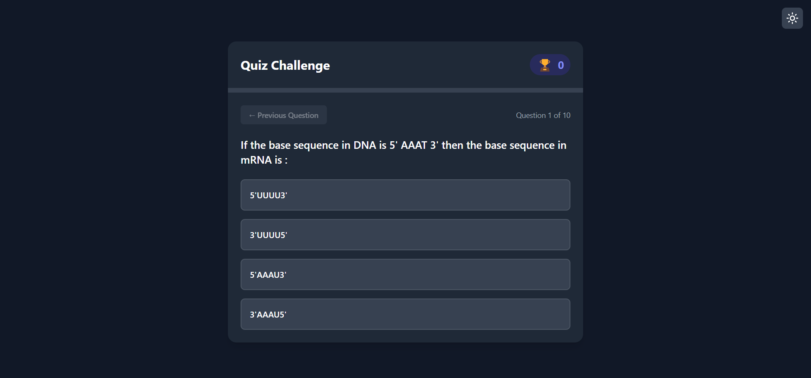
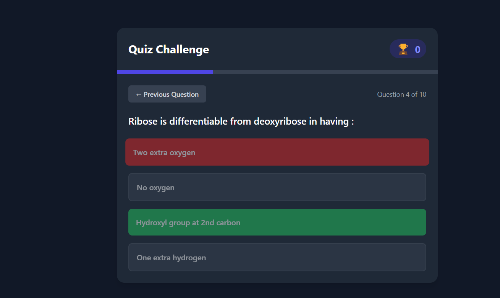
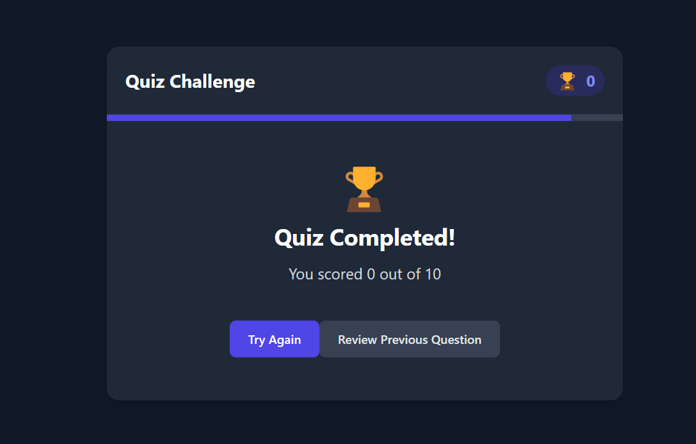
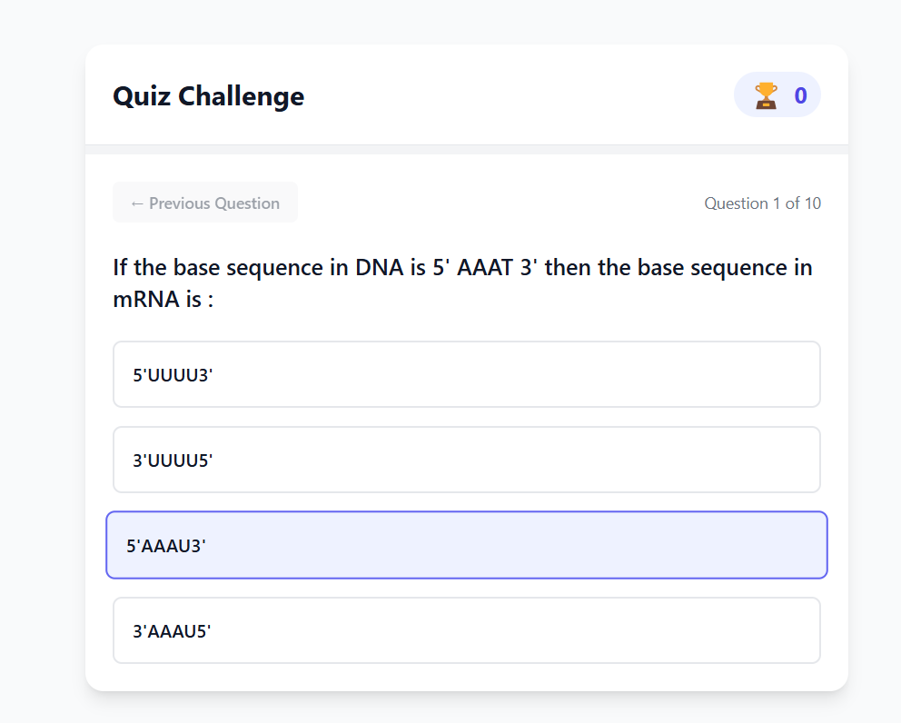

# Interactive Quiz Application

A modern, responsive quiz application built with React and Vite that features real-time feedback, progress tracking, and a sleek user interface with dark mode support.


##  check the site


```bash
https://quizapp-gilt-three.vercel.app/
```


<div style="display: flex; gap: 10px; flex-wrap: wrap">
  
  
  
  
</div>

## ✨ Features

- 🎯 Real-time score tracking
- 🎨 Smooth animations and transitions
- 🌓 Dark mode support
- ✅ Immediate feedback on answers
- ⏪ Navigation between questions
- 🏆 Final score display
- 🔄 Option to retry the quiz
- ⏳ Progress bar tracking
- 📱 Fully responsive design
- 🎭 Loading state with custom animation

## 🚀 Demo

[View Live Demo](#) <!-- Add your deployed demo link here -->

## 🛠️ Prerequisites

Before you begin, ensure you have the following installed:
- Node.js (v14.0.0 or higher)
- npm (v6.0.0 or higher)

## 📦 Installation

1. Clone the repository:
```bash
git clone https://github.com/yourusername/quiz-app.git
```
## 📦 check the site


```bash
https://quizapp-gilt-three.vercel.app/
```

